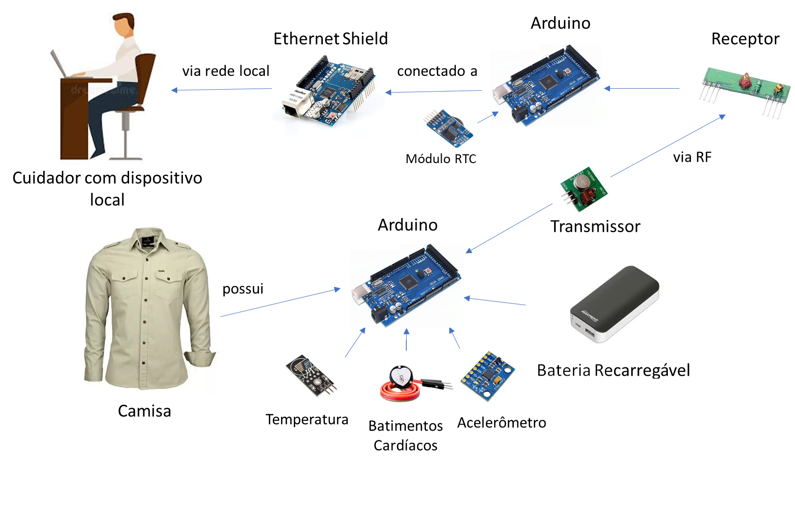
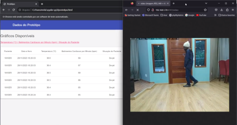

# Wearable Helth Monitoring

 Este trabalho apresenta o desenvolvimento e implementação de um protótipo _wearable_ de monitoramento de saúde concebido para idosos em instituições de cuidados.
 O sistema proposto integra sensores não intrusivos e minimamente invasivos, incluindo frequência cardíaca (Amped 1.5), temperatura corporal (LM35) e acelerômetro (ADXL345), em um protótipo vestível integrado a uma camisa. 

 

 Os dados coletados por esses sensores são processados pelo Arduino Mega 2560 e transmitidas sem fio para um servidor remoto por meio do transmissor RF de 433 MHz (FS1000A). 
 O sistema foi projetado para oferecer monitoramento em tempo real para vários indivíduos simultaneamente, visando aumentar a eficiência no cuidado. 
 
 Com o intuito de automatizar a recuperação desses dados do servidor web, o armazenamento local e a visualização gráfica, desenvolvemos um script Python. Este script foi implementado no dispositivo local do respectivo cuidador, proporcionando uma visão abrangente dos parâmetros de saúde do indivíduo monitorado. 
 
 ## Demonstração

 

## Publicações
+ [ERCAS 2024 - Computação vestível para o cuidado em saúde nas Instituições de Longa Permanência para Idosos: Uma proposta](https://www.researchgate.net/publication/379507820_Computacao_vestivel_para_o_cuidado_em_saude_nas_Instituicoes_de_Longa_Permanencia_para_Idosos_Uma_proposta/references)

+ [TCC Completo - Um protótipo vestível para acompanhamento de saúde](http://dx.doi.org/10.13140/RG.2.2.22559.94884)

## Licença
 Este trabalho é licenciado pela <a rel="license" href="http://creativecommons.org/licenses/by/4.0/">Creative Commons Attribution 4.0 International License</a>. O licenciante não pode revogar essas liberdades desde que você siga os termos da licença:

* __Attribution__ — Você deve dar o __crédito apropriado__ conforme abaixo:

KLEIN, Erick S.; LAZARIN, Nilson M.. Computação vestível para o cuidado em saúde nas Instituições de Longa Permanência para Idosos: Uma proposta. In: ESCOLA REGIONAL DE COMPUTAÇÃO APLICADA À SAÚDE (ERCAS), 9. , 2024, Ouro Preto. Anais [...]. Porto Alegre: Sociedade Brasileira de Computação, 2024 Disponível em: [https://www2.decom.ufop.br/ercas2024/](https://www.researchgate.net/publication/379507820_Computacao_vestivel_para_o_cuidado_em_saude_nas_Instituicoes_de_Longa_Permanencia_para_Idosos_Uma_proposta)
